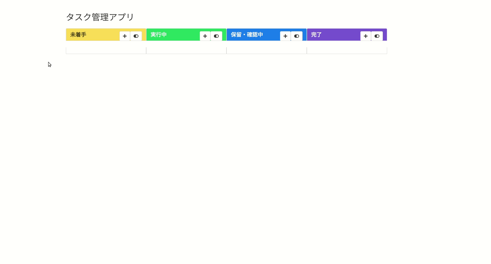

# task-admin

タスク管理アプリ



- Electron:
    - Local GUI application libarary for Node.js

## 更新履歴

- Eel版削除
- Webアプリ版削除

***

## Environment

- OS:
    - Windows 10
    - Ubuntu 18.04
- Applications:
    - Node.js: `10.15.3`
        - yarn package manager: `1.15.2`

### Setup
```bash
# install node modules
$ yarn install

# global install: electron
$ yarn global add electron-prebuilt

# PATHが通っていないなら通しておく
## `yarn global bin` で表示されるPATHを通す

# start electron application
$ electron main.js
```
